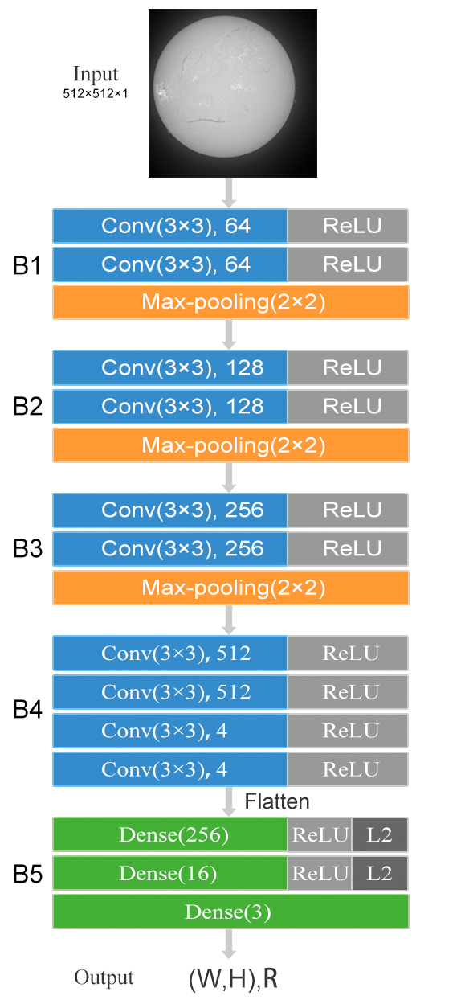

# RCRS
Regression of Center and Radius of the Solar disk

---

## Overview

### Directory Structure

solar_data.py: Data Processing

solar_center_radius_model.py: Model Structure

solar_center_radius_training.py: Training, Validation and Testing

solar_center_radius_predict.py: Independent testing

solar_center_radius_model.hdf5：The trained model file

/log/: a training log

/data/train: The taining images

/data/data.txt: The center coordinates and radius of the solar disk of the training images

/data/train/test/: Independent test directory

/data/train_aug/, /train_aug_label/:Image augmentation directory

### Data

Please downlaod the Dataset from https://sun.bao.ac.cn/hsos_data/download/solar-center-radius-dataset/

, and unzip to the /data/train folder.

### Model and Network

